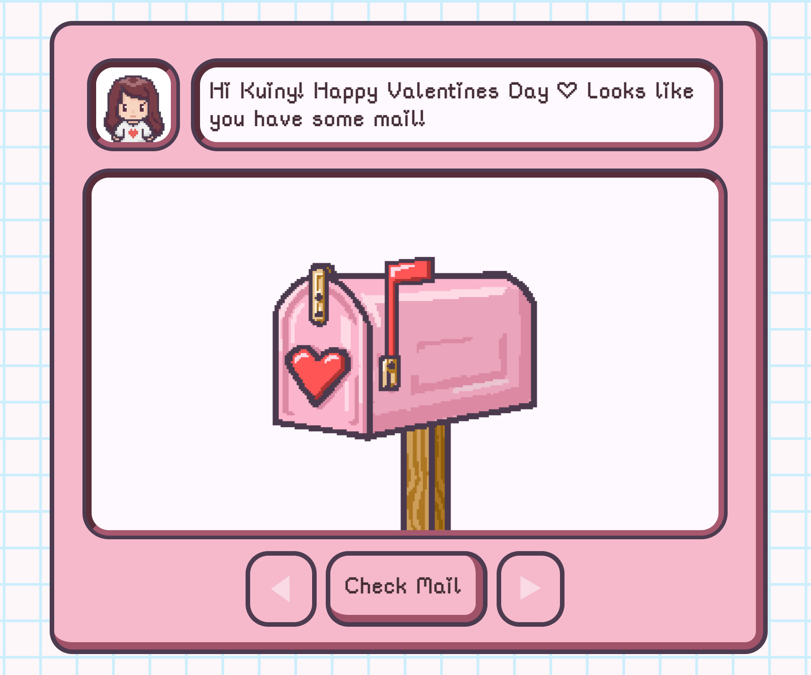
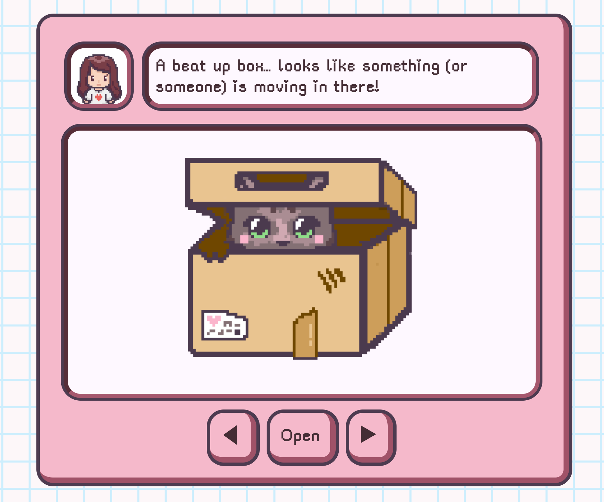
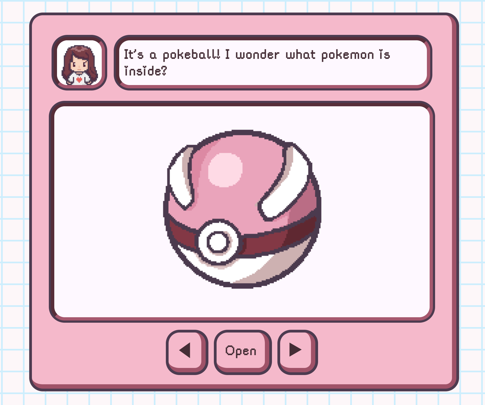
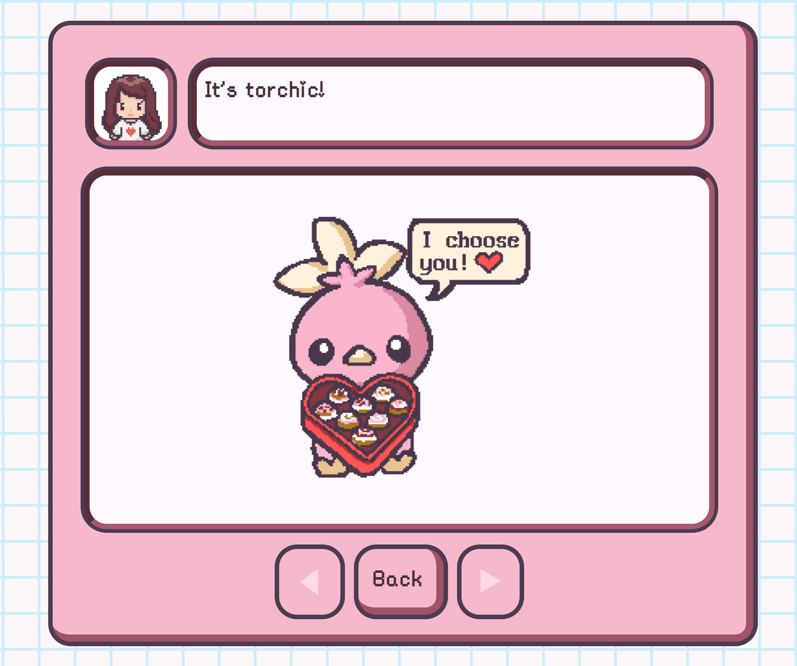

## Valentines Mail Game

**[View live preview here](https://annasmith206.github.io/valentines/)**

||
| ----------- | ----------- |
||

## About
For Valentines Day 2024, I put together this simple JavaScript website as a gift to my boyfriend. I wanted to make something personal, that included my art and was tailored to my boyfriend's interests. This project allowed me to do both, while simultaneously giving me a chance to practice my vanilla JavaScript and CSS skills. 

This game lets the user interact with a love-letter mailbox by entering a mailbox, and then viewing/opening various "letters". As the game progresses, different messages are displayed to acompany the content. 

## Credits
All pixel art images, except for the profile picture of the pixel girl, were drawn by me using Procreate. 
The pixel girl image was found [here on Pinterest](https://www.pinterest.com/pin/790452172111958137/). I am unsure of the original artist. 

I followed [this stack overflow post](https://stackoverflow.com/a/32861765) to create the grid background.

I adapted code I found in [this stack overflow post](https://stackoverflow.com/a/55079549) to implement the bouncing animation on the letters.

## Future Improvements
There are a few things I didn't get around to in version 1 that I'd like to do in the future:
- Improve layout on mobile devices
- Add sound effects 
- Smoother transitions between letters
